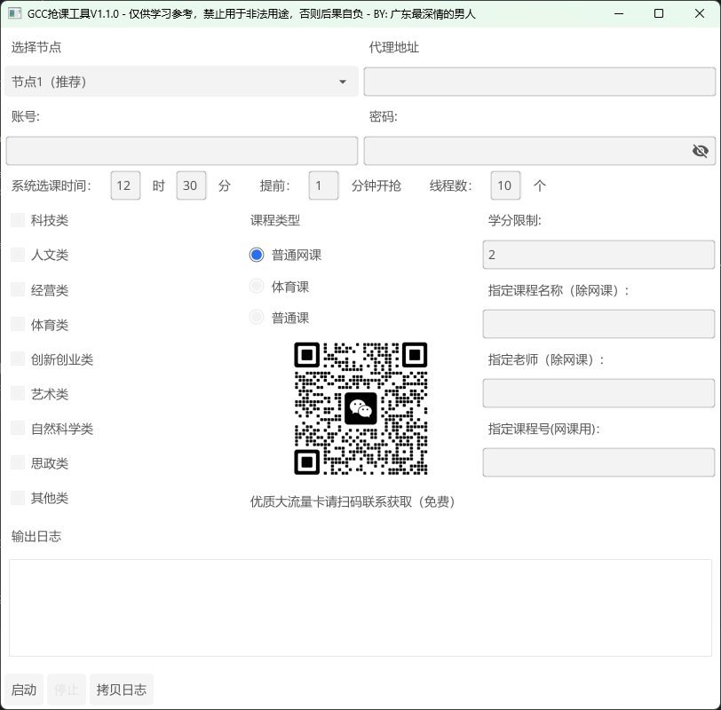

### GCC抢课小工具1.1.0
#### 介绍
基于Go语言（1.23）开发的抢课小工具，支持自动登录、课程筛选、课程抢课等功能。本工具仅用于学习和研究目的，请勿用于非法用途。  
#### 功能
- 自动登录
- 课程筛选
- 课程抢课
- 日志记录
- UI界面
- 多线程处理
- 定时任务
- 代理转发（外网访问内网）
- 允许抢多个指定课程

#### 使用方法
打开编译好的软件，打开后界面如下：
  
在这个界面里，可以看到该工具的所有功能  
部分术语或文字解释：

| 术语或注意事项 | 解释                                                                                   |
|---------|--------------------------------------------------------------------------------------|
| 节点      | 带有“推荐”和“内网”标识的节点均为内网，需要在你电脑上登录了校园网才能使用，其余外网是无需校园网都可以使用                               |
| 代理地址    | 一种代理转发技术，允许没有校园网的情况下使用内网，以达到快速抢课的效果，当然了，代理地址需要有偿帮忙配置                                 |
| 密码      | 密码区分中英文符号，请你在复制粘贴密码的时候，注意看一下有没有空格或者符号不规范之类的                                          |
| 抢课时间 | 这个是教务处文件指定的抢课时间，如实填写就好                                                               |
|提前时间| 因为作者作为老生，抢课的时候有时候教务系统会提前开放，所以加了一个提前开抢功能，以防教务系统不准时，默认1分钟就好                            |
| 线程数| 1个线程可以理解为1个代抢，10个线程就可以理解为有10个人在帮你同时抢课，当然这个取决于你的电脑性能，性能不好的，1-2个线程就好了                  |
| 课程类别 | 这里的课程类别是与教务系统一样的，可以多选，在抢网课或普通课的时候可以用，体育课千万别选体育类！                                     |
| 学分限制| 这个是抢课的时候，如果课程学分低于这个值，那么就会跳过，默认是2学分，如果筛选条件中都没有指定学分的课程可以选的话，系统会自动降低1分，重新选课，直至降至1学分     |
| 指定课程名称| 允许模糊搜索，比如你要羽毛球，你可以直接输入羽毛就行，这里有高级用法，可以联系作者学一下哦                                        |
| 指定老师名称| 不允许模糊匹配，必须要输入老师的全名，比如张三，就填张三，当然，这个有风险，因为有时候指定的老师不开这门课                                |
| 指定课程号| 不允许模糊匹配，必须要输入课程的完整课程号，比如：0200200200，就填0200200200，多个课程号请用,隔开。当然，这个有风险，因为有时候指定的课程号没有开课 |
| 拷贝日志| 当你抢课的时候，想看软件的执行完整日志，可以点击拷贝日志按钮|  

选好节点、填好账号密码、要抢课的类型以及课程信息等等，就可以点开始啦。  
祝你好运！

#### 更新日志
2025.06.27  
1. 修复了获取课程列表失败问题
2. 接口参数改成了动态参数，在data.json，请勿随意更改，若要最新的data.json，请联系作者，或者看作者仓库有没有
3. 优化UI界面布局
